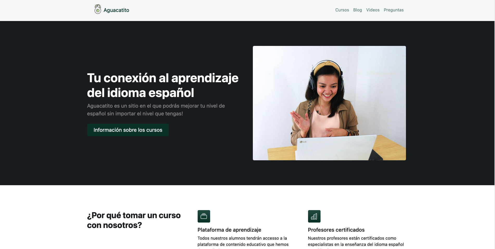

# WD-Bootsrap-aguacatito-spanish

## :wave: Welcome

This Bootstrap project is a simple demonstration of responsive design and basic web technologies, it is an online Spanish classes website. The website is designed to be responsive, meaning it adapts to different screen sizes and devices to provide an optimal viewing experience for the user. The website is built using Bootstrap, a popular front-end framework that provides a consistent look and feel across different web browsers.

## 💻 Description

The website uses HTML, CSS and JavaScript, and it utilizes the power of Bootstrap to create a responsive and visually appealing design. It is a basic demonstration of how to use Bootstrap to create a responsive website that looks great on all devices, and it can serve as a starting point for more complex projects.

## :gear: Packages & Requirements

- Bootstrap
- HTML
- CSS
- Javascript

## Preview

